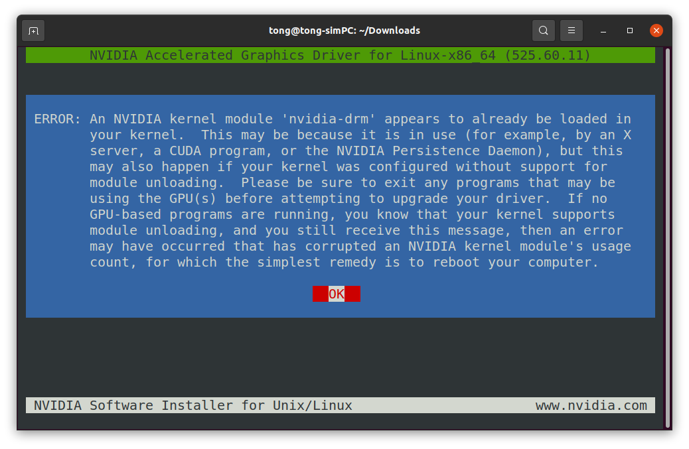

# Isaac-Sim-Install-Guide
An installation guide/log of Isaac Sim on Ubuntu 20.04

## Following the 'Workstation Setup'
Follow the steps on [the official Omniverse IssacSim Workstation Setup](https://docs.omniverse.nvidia.com/app_isaacsim/app_isaacsim/install_workstation.html#isaac-sim-app-install-workstation).

1. Download the Omniverse Launcher (need registration). It is an AppImage file. [Change it to an executable file](https://docs.appimage.org/introduction/quickstart.html) and run it.

2. Install Cache. Use the default paths for instllation, and check the box for installing Cache. (If not checked, don't worry, go to EXCHANGE tab after installation, and search for 'cache', then install it there.)

3. Install Nucleus. Go to the NUCLEUS tab, and click 'Add local nucleus service'. Follow [this official guide](https://docs.omniverse.nvidia.com/prod_nucleus/prod_nucleus/workstation/installation.html) for the rest of the steps. If successful, click the 'three bars' next to 'Local Nucleus Service' and select 'Settings', it should bring up the status of the Nucleus service.

4. Install Isaac Sim. Go to the EXCHANGE tab, and search for 'isaac', install it. (This may take a while, and there are different ways this can fail. Refer to the next section for some typical issues and resolutions.)

## Upgrade Ubuntu 20.04 NVIDIA Drivers (before installing Isaac Sim)

One of the reasons that Isaac Sim installation may fail is that your NVIDIA driver is not up to the system requirements. Check the system requirement [page](https://docs.omniverse.nvidia.com/app_isaacsim/app_isaacsim/requirements.html#isaac-sim-requirements-isaac-sim-drivers)) and reinstall the recommended driver version.

1. Remove / purge previous version, use the guide on this [post](https://askubuntu.com/questions/206283/how-can-i-uninstall-a-nvidia-driver-completely), and additionally use this [guide](https://gist.github.com/hangsong/c0c3839ebfea7b683287db539785bc10).

2. Download the [recommended](https://docs.omniverse.nvidia.com/app_isaacsim/app_isaacsim/requirements.html#isaac-sim-requirements-isaac-sim-drivers) driver version [525.60.11](https://www.nvidia.com/download/driverResults.aspx/196723/en-us/) and install it using the command:
```
sh ./NVIDIA-Linux-x86_64-525.60.11.run
```

> **NOTE:** you may need to first install dependencies and block the **Nouveau Driver** before installing the NVIDIA driver. Refer to the [post](https://gist.github.com/hangsong/c0c3839ebfea7b683287db539785bc10). If something is not right, try reboot the system twice. Yes, twice. It worked to solve one of my bugs.

> **NOTE:** you may see the following error during installation regarding `nvidia-drm`. A resolution that worked for me is this [post](https://clay-atlas.com/us/blog/2020/03/04/linux-english-note-how-to-disable-nvidia-drm/). Open this post on your phone or alternative device, because this post will lead you into the multi-user target state without any GUI.

